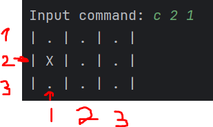
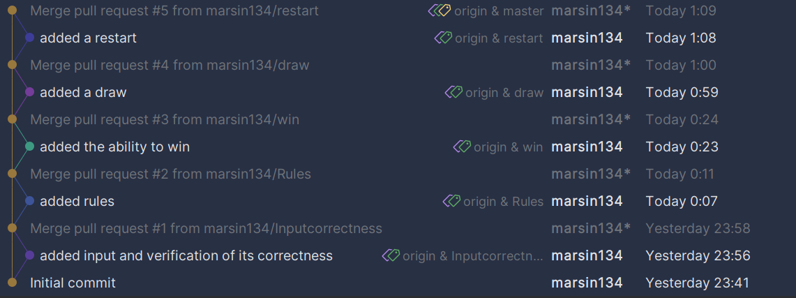

# Крестики нолики

## Описание

Консольная версия игры 'Крестики-нолики'. После запуска main.go у вас появится возможность вводить команды:

| Команды | Описание                                                                                                                                                                                                                                                         |
|---------|------------------------------------------------------------------------------------------------------------------------------------------------------------------------------------------------------------------------------------------------------------------|
| c       | Комманда для ввода координат.Первая часть команды указывает номер линии, а вторая — номер столбца. К примеру, команда «c 2 1» заменяет ячейку, расположенную на второй линии и в первом столбце.   |
| r       | Перезапуск игры                                                                                                                                                                                                                                                  |
| s       | Завершение игры                                                                                                                                                                                                                                                  |

После того как вы введёте команду «с» и укажете номер координат, на экране появится игровое поле. Если вы победите или
сыграете вничью, система выведет соответствующее сообщение, и игра завершится. Чтобы перезапустить игру, введите команду
«r», а для завершения — «s».

## Дерево коммитов

